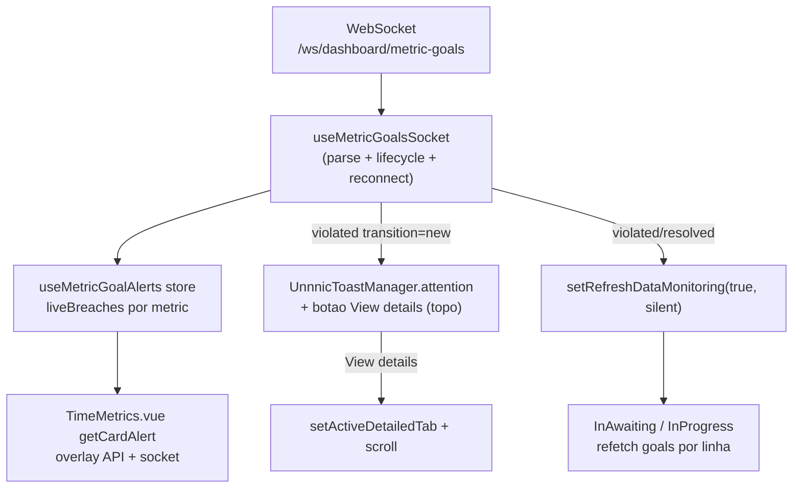

# Socket + Notificações de Alertas Operacionais

## Contexto

O projeto **não tem WebSocket hoje** (só polling HTTP de 60s + `postMessage`). Auth vem de `useConfig().token` e `useConfig().project.uuid`; env vars via helper `env()` de [src/utils/env.js](src/utils/env.js). Os alertas de display (cards/tabelas) já funcionam via `MetricGoalBreach` normalizado (camelCase) gateado por `insightsOperationalAlerts`.

O socket envia eventos **agregados por métrica** (sem dado por linha):
- `metric_goal.violated` (`transition: "new"`) → toast + atualiza estado
- `metric_goal.update` (`transition: "update"`, a cada 30s) → atualiza contador, sem renotificar
- `metric_goal.resolved` → limpa estado da métrica

Decisões confirmadas: toast no **topo** via override global de CSS no `UnnnicToastManager.attention`; tabelas reagem com **refresh silencioso**.

## Fluxo

## Passos

### 1. Branch (Graphite)
Criar branch empilhada sobre a atual via lifecycle do gt:
`gt create feat/alert-risk-socket` (base = `feat/alert-risk-display`).

### 2. Variável de ambiente
- [.env](.env): adicionar `CHATS_WEBSOCKET_URL="wss://engine-chats.stg.cloud.weni.ai"` (e a linha PROD comentada `# CHATS_WEBSOCKET_URL=wss://chats-engine.weni.ai`).
- [.env.local.sample](.env.local.sample): adicionar a chave de exemplo.
- Lida via `env('CHATS_WEBSOCKET_URL')`. O path `/ws/dashboard/metric-goals` e a query `?project={uuid}&Token={jwt}` são montados no composable.

### 3. Store de alertas ao vivo
Novo [src/store/modules/humanSupport/metricGoalAlerts.ts](src/store/modules/humanSupport/metricGoalAlerts.ts):
- Estado: `liveBreaches: Record<MetricKey, MetricGoalBreach | null>`, `connectionState`.
- Actions: `applyViolated(content)`, `applyUpdate(content)`, `applyResolved(content)`, `reset()`.
- Mapeia payload do socket → `MetricGoalBreach` (camelCase): `isBreached = state === 'violating'`, `breachedRoomsCount = violating_count`, `thresholdSeconds = threshold_seconds`. `thresholdValue`/`unit` derivados de `threshold_seconds` por helper (maior unidade inteira: 3600→h, 60→m, senão s).

### 4. Composable do socket
Novo [src/composables/useMetricGoalsSocket.ts](src/composables/useMetricGoalsSocket.ts):
- Monta URL `${env('CHATS_WEBSOCKET_URL')}/ws/dashboard/metric-goals?project=${project.uuid}&Token=${token}`.
- `connect()` / `disconnect()`, parse de `event.data` por `type`.
- `metric_goal.violated` + `transition === 'new'` → `store.applyViolated` + dispara toast + `setRefreshDataMonitoring(true, silent)`.
- `transition === 'update'` → `store.applyUpdate` (sem toast).
- `metric_goal.resolved` → `store.applyResolved` + `setRefreshDataMonitoring(true, silent)`.
- Reconexão com backoff exponencial (cap ~30s) + reconectar ao mudar token/project; cleanup no disconnect. Sem heartbeat custom (a menos que o backend exija ping).

### 5. Toast (attention + botão, topo)
- Função `showMetricGoalToast(content)` usando `UnnnicToastManager.attention(title, description, { button })` (padrão de [src/composables/useFeedbackSurvey.ts](src/composables/useFeedbackSurvey.ts)).
- Título: `operational_alerts.toast.title`; descrição por métrica (`operational_alerts.toast.{metric}` com `{count}`); botão `operational_alerts.toast.view_details` cuja action navega ao detalhe (reusar lógica de `handleCardClick` em [TimeMetrics.vue](src/components/insights/humanSupport/Monitoring/TimeMetrics.vue): `setActiveDetailedTab` + `setForceLoadDetailed` + scroll). Duração padrão (5s).
- Override global de CSS (em [src/App.vue](src/App.vue) style global, junto ao bloco de z-index existente) para posicionar `[unnnic-toast-container] .unnnic-toast` no topo-direita (`top: 16px; bottom: auto`). Observação: move também o toast da pesquisa de feedback para o topo (efeito aceito).
- i18n nos 4 locales ([en](src/locales/en.json), [pt_br](src/locales/pt_br.json), [es](src/locales/es.json), [ro](src/locales/ro.json)) no namespace `operational_alerts.toast` seguindo o Content Guide VTEX (sentence case, sem ponto final em título/labels curtos).

### 6. Cards ao vivo (overlay)
Em [TimeMetrics.vue](src/components/insights/humanSupport/Monitoring/TimeMetrics.vue) `getCardAlert`: usar o goal da API (`timeMetricsData[goalKey]`) e, se ausente/não-breached, cair para `metricGoalAlerts.liveBreaches[metric]`. Mantém o gate `insightsOperationalAlerts`.

### 7. Tabelas (refresh silencioso)
Sem mudança de UI: o composable chama `setRefreshDataMonitoring(true, silent=true)`, e os watchers existentes em [InAwaiting.vue](src/components/insights/humanSupport/Monitoring/Tables/InAwaiting.vue) / [InProgress.vue](src/components/insights/humanSupport/Monitoring/Tables/InProgress.vue) refazem o fetch e recalculam `rowAlert` via `useTableRowAlert`.

### 8. Ciclo de vida
Inicializar o socket quando o usuário está no monitoramento com a flag ativa. Ponto de montagem: [Monitoring.vue](src/components/insights/humanSupport/Monitoring/Monitoring.vue) (`onMounted/onUnmounted`) ou junto ao gate de `showOperationalAlerts` em [HeaderHumanSupport.vue](src/components/insights/Layout/Headers/HeaderHumanSupport.vue). Conectar só com `token` + `project.uuid` + flag; desconectar no unmount; reconectar em troca de projeto.

### 9. Testes
- Unit do store `metricGoalAlerts` (violated/update/resolved, derivação de unit/value).
- Unit do composable com `WebSocket` mockado (parse de eventos, toast só no `transition: "new"`, refresh disparado, reconexão).
- Atualizar [TimeMetrics.spec.js](src/components/insights/humanSupport/Monitoring/__tests__/TimeMetrics.spec.js) para o overlay do socket.

## Fora de escopo
- Disparo de e-mail (responsabilidade do backend).
- Highlight por linha vindo do socket (payload é agregado; tabelas refazem fetch).